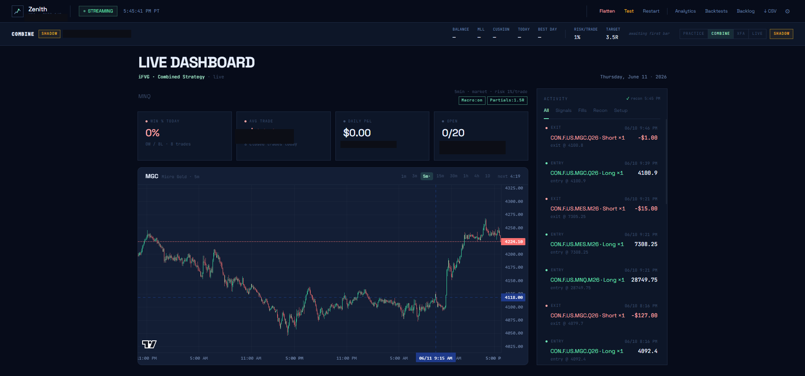

# topstep-bot

> **Zenith** — a local-first algorithmic trading bot for the Topstep $50K Combine,
> built in Python (FastAPI/asyncio) with a React + TypeScript live dashboard. Includes
> an autonomous research loop that backtests strategy ideas against 5 years of tick
> data and rejects the losers via walk-forward validation. 819 automated tests.



Sweep/displacement futures bot for the Topstep $50K Combine. Runs locally
per Topstep's no-VPS rule.

## Setup

**1. Create the venv and install dependencies**

```powershell
py -m venv .venv
.venv\Scripts\activate

# project-x-py requires uvloop which doesn't support Windows.
# Install it dep-free, then add everything else manually.
pip install project-x-py --no-deps
pip install cachetools deprecated "httpx[http2]" lz4 msgpack-python numpy `
    orjson plotly polars pydantic pytz pyyaml requests rich `
    signalrcore websocket-client

pip install pytest pytest-asyncio pytest-timeout hypothesis
```

Mac/Linux: `pip install project-x-py "httpx[http2]"` works directly.

**2. Install frontend dependencies and build**

```powershell
cd frontend
npm install
npm run build   # outputs to app/api/static/
cd ..
```

**3. Configure credentials**

Copy `.env.example` to `.env` and fill in:

```
PROJECT_X_USERNAME=your_username
PROJECT_X_API_KEY=your_key
TOPSTEP_BOT_MODE=paper
TOPSTEP_BOT_INSTRUMENT=MGC
```

**4. Fetch historical bars**

Single symbol:
```powershell
.venv\Scripts\python.exe scripts\fetch_bars.py --symbol MGC --days 30
# saves bars_MGC.csv
```

Multiple symbols at once:
```powershell
.venv\Scripts\python.exe scripts\fetch_bars.py --symbol MGC,MNQ,ES --days 30
# saves bars_MGC.csv, bars_MNQ.csv, bars_ES.csv
```

The bot auto-loads `bars_{INSTRUMENT}.csv` in paper mode -- no env var needed.

**5. Run**

```powershell
.\dev.ps1          # loads .env automatically
.\dev.ps1 -Paper   # force paper mode
.\dev.ps1 -Live    # force live mode
```

Dashboard opens at `http://127.0.0.1:5174`.

For frontend development with hot-reload, run in a second terminal:

```powershell
cd frontend
npm run dev
# open http://localhost:5173 (proxies /api to the bot)
```

## Configuration panel

Click the gear icon (⚙) in the dashboard header to open the config panel.
From there you can change the instrument, timeframes, and all strategy
parameters without editing any files. Changes are saved to `bot_config.json`
and take effect on the next bot restart.

`bot_config.json` is the mutable config layer on top of `.env`. Values set
there override the corresponding env vars.

## Tests

```powershell
.venv\Scripts\python.exe -m pytest tests/ -v
```

All 819 tests should pass.

## Backtest

Single run:

```powershell
.venv\Scripts\python.exe scripts\backtest.py --symbol MGC --output-dir backtest_results
# auto-loads bars_MGC.csv
```

Parameter sweep:

```powershell
.venv\Scripts\python.exe scripts\backtest.py --symbol MGC `
    --sweep "body_atr_multiple=0.8,1.0,1.2,1.5" `
    --sweep "swing_lookback=2,3,4" `
    --sweep "r_multiple=1.5,2.0,2.5,3.0" `
    --output-dir backtest_results
```

Multi-symbol (runs the same sweep across each symbol):

```powershell
.venv\Scripts\python.exe scripts\backtest.py --symbol MGC,MNQ,ES `
    --sweep "r_multiple=2.0,2.5,3.0" `
    --output-dir backtest_results
```

Sweep parameters: `r_multiple`, `displacement_window_bars`, `stop_buffer`,
`swing_lookback`, `min_penetration`, `multi_bar_window`, `atr_period`,
`body_atr_multiple`, `min_body_to_range_ratio`, `min_absolute_body`.

## Scripts

| Script | Purpose |
|--------|---------|
| `scripts/fetch_bars.py` | Pull OHLCV bars from ProjectX API (`--symbol MGC,MNQ,ES --days 30`) |
| `scripts/backtest.py` | Replay bars through strategy; supports parameter sweeps and multi-symbol |
| `scripts/sdk_diagnostic.py` | Verify SDK field names before going live |
| `dev.ps1` | Load `.env` and launch the bot (Windows) |

## Architecture

```
app/
├── main.py              # Entry point + detector defaults
├── config.py            # Env-driven config loading
├── bot_config.py        # Mutable BotConfig model (bot_config.json overlay)
├── replay.py            # CSV -> Bar stream for paper mode
├── api/
│   ├── server.py        # FastAPI dashboard + GET/PATCH /api/config
│   └── static/          # Built Vite app (npm run build output)
├── risk/
│   ├── config.py        # Account constants ($50K Combine numbers)
│   ├── state.py         # Trailing MLL, daily P&L, lockout state
│   └── pretrade.py      # Gate: every order passes through check()
├── broker/
│   ├── events.py        # Bar, Fill, MarkToMarket -- internal types
│   ├── protocol.py      # Broker protocol
│   ├── paper.py         # In-memory paper broker
│   └── topstepx.py      # Live wrapper around project-x-py
├── strategy/
│   ├── killzone.py      # Time-window gate (London / NY AM / NY PM)
│   ├── liquidity.py     # Swing tracking + sweep detection
│   ├── displacement.py  # Impulsive moves + FVG
│   └── composer.py      # State machine -> Signal
└── execution/
    ├── engine.py        # Wire: bar -> strategy -> gate -> broker
    └── reconciler.py   # Periodic broker-vs-internal-state diff

frontend/                # Vite + React 18 + TypeScript + Tailwind v3
├── src/
│   ├── App.tsx
│   ├── components/      # Header, ConfigPanel, MetricsGrid, feed rows
│   ├── hooks/           # useStream (WebSocket), useConfig (REST)
│   └── types.ts
└── vite.config.ts       # builds to app/api/static/, proxies /api in dev
```

## Strategy defaults (tuned from backtest)

Defaults live in `app/main.py::_build_runner` and can be overridden via
the config panel (saved to `bot_config.json`).

| Parameter | Value | Notes |
|-----------|-------|-------|
| `swing_lookback` | 2 | Bars each side for swing confirmation |
| `min_penetration` | $0.20 | Min distance past a level for a sweep tag |
| `body_atr_multiple` | 1.0 | Displacement threshold (x ATR) |
| `atr_period` | 14 | ATR lookback |
| `r_multiple` | 2.5 | Target = 2.5x risk |
| `stop_buffer` | $0.30 | Extra cushion added to raw stop distance |

## Risk rules ($50K Combine)

- **Trailing MLL**: starts at $48,000, trails highest intraday equity, locks at $50,000
- **Daily loss limit**: $1,000, resets at 5pm CT
- **Max position**: 5 minis / 50 micros
- **Soft buffer**: $500 -- bot self-stops before official limits

See `tests/test_risk.py::TestTrailingMLL` for exact trailing behavior including
the published Topstep example.

## Important notes

**No-VPS rule**: Topstep prohibits VPS, VPN, and remote servers for API trading.
The bot must run on the same machine you trade from. Windows Task Scheduler setup
is in `deploy/windows/`.

**Reconciler behavior**:
- Balance off < $50 -> silent adjust
- Balance off > $50 -> adopt broker truth + lock out
- Contract count differs -> emergency flatten + lock out

**Live trading**: Run `scripts/sdk_diagnostic.py` against a demo account before
switching to live mode. The SDK field-name assumptions in `app/sim/topstepx.py`
need verification on a real connection.
